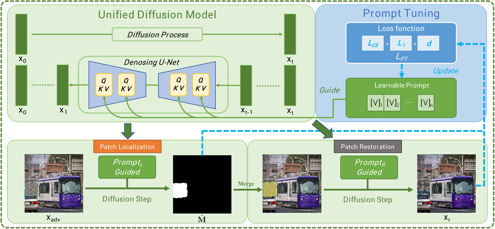

# **DIFFender**

This repository contains the official implementation of the paper "[DIFFender: Diffusion-Based Adversarial Defense against Patch Attacks](https://arxiv.org/pdf/2306.09124)" by Caixin Kang, Yinpeng Dong, Zhengyi Wang, Shouwei Ruan, Yubo Chen, Hang Su, Xingxing Wei.

🔥 Accepted by ECCV 2024.




## **Overview**


This repository implements the novel defense method **DIFFender** proposed in the paper, which aims to develop a reliable diffusion model-based defense mechanism against patch attacks, simultaneously performs patch localization and restoration tasks, and can be extended to various scenarios and real-world physical environments.

## **Installation**


### **Requirements**

- Python >= 3.6.0
- PyTorch >= 1.7

### **Setup**

1. Clone the repository:
   ```bash
   git clone https://github.com/kkkcx/DIFFender.git
   cd DIFFender
   ```

2. Install the required packages:
   ```bash
   pip install -r requirements.txt
   ```

## **Usage**


### **Running**

To run the demo of text-prompt version, run:

```bash
python DIFFender_text_demo.py
```


### **Prompt Tuning Setup**

For the prompt-tuning module, we follow the setup from **[CoOp](https://github.com/KaiyangZhou/CoOp)**. To configure the environment and integrate our prompt-tuning code with DIFFender, please follow the steps below:


#### **Step 0: Install Dassl.pytorch and Required Packages**

CoOp is built on top of the toolbox **Dassl.pytorch**, so you need to install the **Dassl** environment first. Follow the instructions described [here](https://github.com/KaiyangZhou/Dassl.pytorch) to install Dassl as well as PyTorch.

```bash
pip install -r requirements.txt
```


#### **Step 1: Clone the CoOp Repository**


First, clone the official CoOp repository and set up its environment. After that, run the following command under `CoOp/` to install additional packages required by CLIP.


```bash
git clone https://github.com/KaiyangZhou/CoOp.git
cd CoOp
pip install -r requirements.txt
```

#### **Step 2: Replace CoOp Prompt Tuning Code**

Next, replace the `CoOp/trainers/coop.py` file with the `Prompt_tuning_demo.py` file provided in this repository, which contains the modifications needed for DIFFender's prompt tuning module.


#### **Step 3: Run Prompt Tuning with DIFFender**

After replacing the file, you can now run the prompt-tuning module using the same CoOp environment:

```bash
bash scripts/coop/main.sh imagenet vit_l14_ep50 end 16 8 False
```

Make sure to use the configurations that are compatible with DIFFender.

### **Note:**

- For more detailed results, refer to the [paper](https://arxiv.org/pdf/2306.09124).


## **TODO List**

- [x] Implement preliminary demo of DIFFender.
- [ ] Add complete code, detailed documentation and examples.

## **Citation**


If you find this repository useful, please cite the following:

```
@article{kang2023diffender,
  title={Diffender: Diffusion-based adversarial defense against patch attacks in the physical world},
  author={Kang, Caixin and Dong, Yinpeng and Wang, Zhengyi and Ruan, Shouwei and Su, Hang and Wei, Xingxing},
  journal={arXiv preprint arXiv:2306.09124},
  year={2023}
}
```


## **Acknowledgments**

This work builds upon the codebase of **[CoOp](https://github.com/KaiyangZhou/CoOp)**, and we sincerely thank the authors for their contributions.


## **License**

This project is licensed under the [MIT License](LICENSE).
